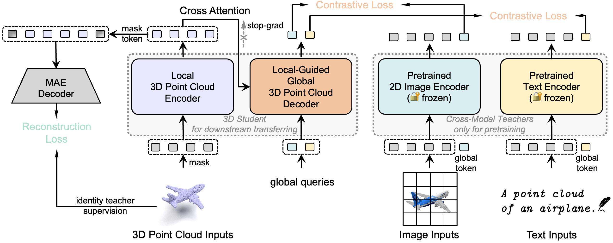

# ReCon: Contrast with Reconstruct

[](https://paperswithcode.com/sota/3d-point-cloud-linear-classification-on?p=contrast-with-reconstruct-contrastive-3d)
[](https://paperswithcode.com/sota/3d-point-cloud-classification-on-scanobjectnn?p=contrast-with-reconstruct-contrastive-3d)
[](https://paperswithcode.com/sota/3d-point-cloud-classification-on-modelnet40?p=contrast-with-reconstruct-contrastive-3d)
[](https://paperswithcode.com/sota/zero-shot-transfer-3d-point-cloud?p=contrast-with-reconstruct-contrastive-3d)
[](https://paperswithcode.com/sota/zero-shot-transfer-3d-point-cloud-1?p=contrast-with-reconstruct-contrastive-3d)
[](https://paperswithcode.com/sota/zero-shot-transfer-3d-point-cloud-2?p=contrast-with-reconstruct-contrastive-3d)

Created by  [Zekun Qi](https://github.com/qizekun)\*, [Runpei Dong](https://runpeidong.com/)\*, [Guofan Fan](https://github.com/Asterisci), [Zheng Ge](https://scholar.google.com.hk/citations?user=hJ-VrrIAAAAJ&hl=en&oi=ao), [Xiangyu Zhang](https://scholar.google.com.hk/citations?user=yuB-cfoAAAAJ&hl=en&oi=ao), [Kaisheng Ma](http://group.iiis.tsinghua.edu.cn/~maks/leader.html), [Li Yi](https://ericyi.github.io/)

[[arXiv]](https://arxiv.org/abs/2302.02318) 

This repository contains the code release of paper **Contrast with Reconstruct: Contrastive 3D Representation Learning Guided by Generative Pretraining**.

## Contrast with Reconstruct

Mainstream 3D representation learning approaches are built upon contrastive or generative modeling pretext tasks, where great improvements in performance on various downstream tasks have been achieved. However, by investigating the methods of these two paradigms, we find that (i) contrastive models are data-hungry that suffer from a representation over-fitting issue; (ii) generative models have a data filling issue that shows inferior data scaling capacity compared to contrastive models. This motivates us to learn 3D representations by sharing the merits of both paradigms, which is non-trivial due to the pattern difference between the two paradigms. In this paper, we propose *contrast with reconstruct* (**ReCon**) that unifies these two paradigms. ReCon is trained to learn from both generative modeling teachers and cross-modal contrastive teachers through ensemble distillation, where the generative student is used to guide the contrastive student. An encoder-decoder style ReCon-block is proposed that transfers knowledge through cross attention with stop-gradient, which avoids pretraining over-fitting and pattern difference issues. ReCon achieves a new state-of-the-art in 3D representation learning, e.g., 91.26% accuracy on ScanObjectNN.

<div  align="center">    
 
</div>

Code will be coming soon after the reviewing process.

## Contact

If you have any questions related to the code or the paper, feel free to email Zekun (`qizekun@gmail.com`) or Runpei (`runpei.dong@gmail.com`). 

## License

ReCon is released under MIT License. See the [LICENSE](./LICENSE) file for more details. Besides, the licensing information for `pointnet2` modules is available [here](https://github.com/erikwijmans/Pointnet2_PyTorch/blob/master/UNLICENSE).

## Acknowledgements

This codebase is built upon [Point-MAE](https://github.com/Pang-Yatian/Point-MAE), [Point-BERT](https://github.com/lulutang0608/Point-BERT), [CLIP](https://github.com/openai/CLIP), [Pointnet2_PyTorch](https://github.com/erikwijmans/Pointnet2_PyTorch) and [ACT](https://github.com/RunpeiDong/ACT)

## Citation

If you find our work useful in your research, please consider citing:

```tex
@article{recon2023,
  title={Contrast with Reconstruct: Contrastive 3D Representation Learning Guided by Generative Pretraining},
  author={Qi, Zekun and Dong, Runpei and Fan, Guofan and Ge, Zheng and Zhang, Xiangyu and Ma, Kaisheng and Yi, Li},
  journal={arXiv preprint arXiv:2302.02318},
  year={2023}
}
```

